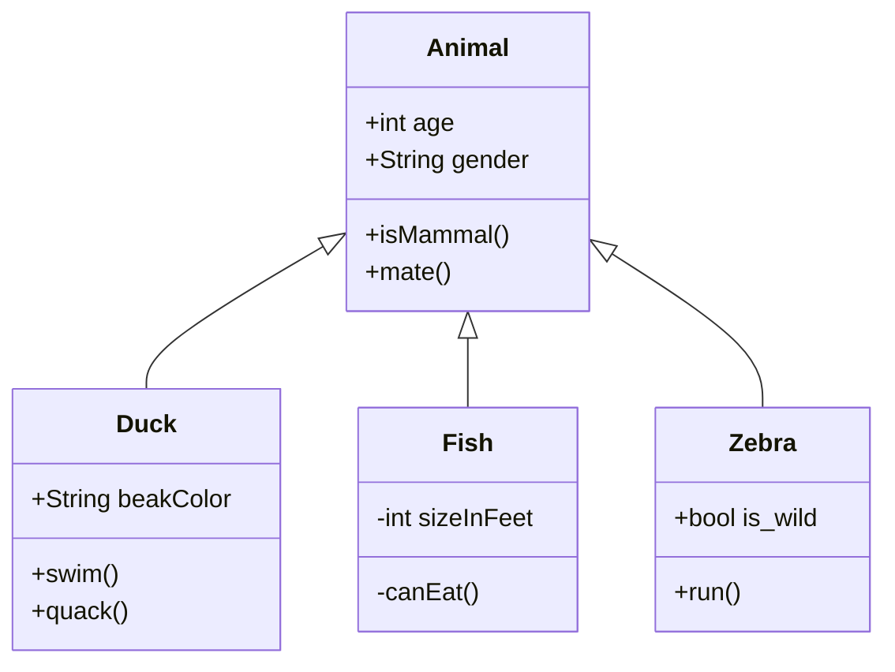

# Console App

Aplikasi ini mencakup fungsi perhitungan nilai tukar mata uang dolar ke rupiah.
Satu dolar dianggap senilai Rp15.000

## Scope & Functionalities
* User dapat memasukkan angka
* User dapat menyentuh tombol hitung
* User mendapat info "INVALID" jika yang dimasukkan berupa teks.

## How does it works?
Diawali dari method "MainWindow" pada class `MainWindow.xaml.cs` kita mendeklarasikan fungsi dari `CurrencyController.cs`
```c#
public MainWindow()
{
    InitializeComponent();
    currency = new CurrencyController();
}
```
Logika perhitungan terdapat pada `CurrencyController.cs`
```c#
public string usdToIdr(string nominal)
{
    var nominalDouble = Convert.ToDouble(nominal);
    var Result = nominalDouble * 15000;
    return Convert.ToString(result);
} 
```

### Latihan
1. Percobaan-percobaan
* Pada percobaan 1 nomor 4, ketika saya memasukkan sembarang angka maupun huruf lalu klik tombol Hitung, maka tampilan akan berubah sesuai dengan input yang dimasukkan.
* Pada percobaan 2 nomor 2, angka yang saya inputkan akan ditampilkan setelah dikalikan 10000 oleh komputer.
* Pada percobaan 2 nomor 3, ketika saya menginputkan sembarang huruf, saya mengalami error karena input yang dimasukkan akan diubah ke tipe double di mana tipe string tidak bisa diubah ke tipe double.
* Pada percobaan 3 nomor 2, angka yang saya inputkan akan ditampilkan setelah dikalikan 4 oleh komputer.
* Pada percobaan 3 nomor 3, ketika saya menginputkan sembarang huruf, maka hasil yang ditampilkan adalah 'invalid'.
2. `CurrencyController.cs` diperlukan untuk memisahkan fungsi yang mengatur konversi angka dengan code utama agar menghasilkan clean code.
3. Kegunaan isAllowed method adalah untuk memberitahu fungsi Button_Hitung_Click pada `MainWindow.xaml.cs` apakah data yang dimasukkan pengguna berupa angka atau huruf.
4. Fungsi RegEx pada percobaan nomor 4 adalah untuk mengetahui pola tertentu yang dihasilkan oleh input pengguna. Misal, bila pengguna menginputkan angka dan huruf secara bersamaan (contoh: 3eer), maka RegEx akan menyimpulkan bahwa input yang dimasukkan bukanlah angka sehingga fungsi Button_Hitung_Click akan menampilkan output 'invalid' alih-alih aplikasinya menjadi error.
5. 
